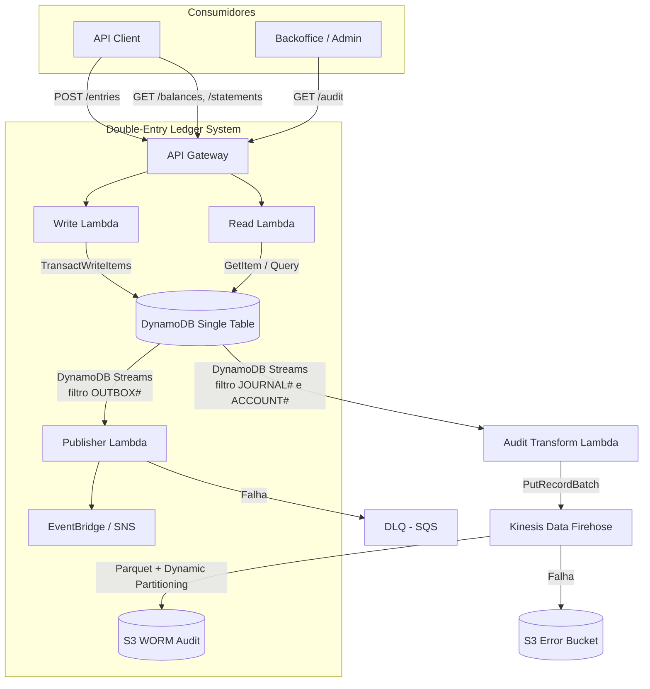
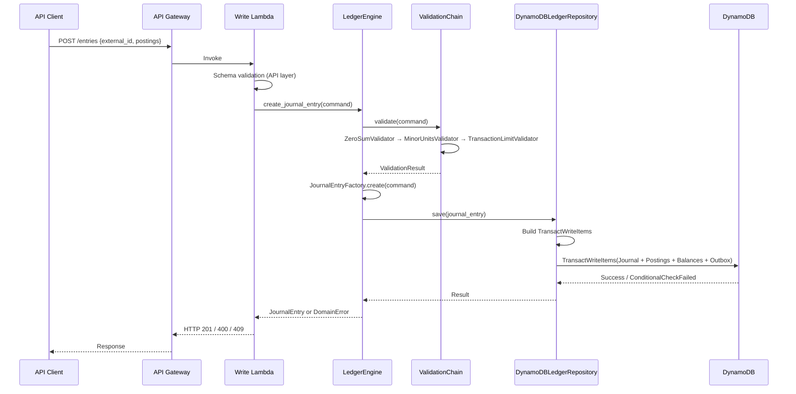
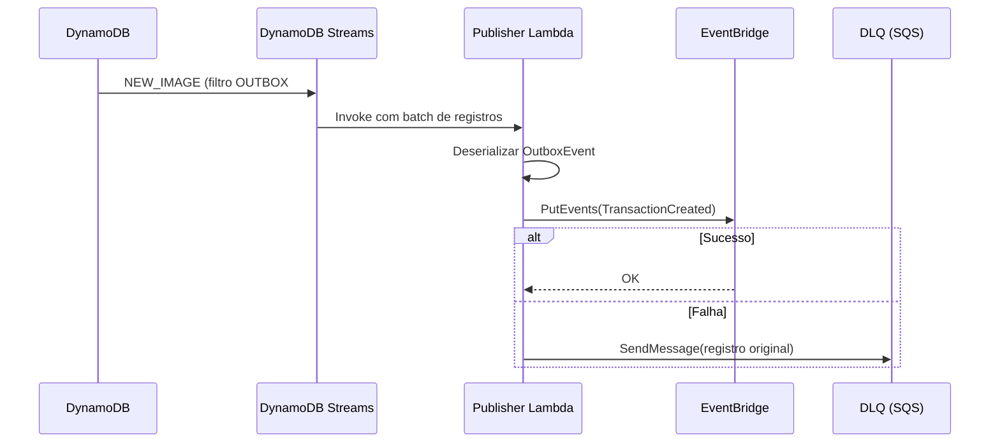
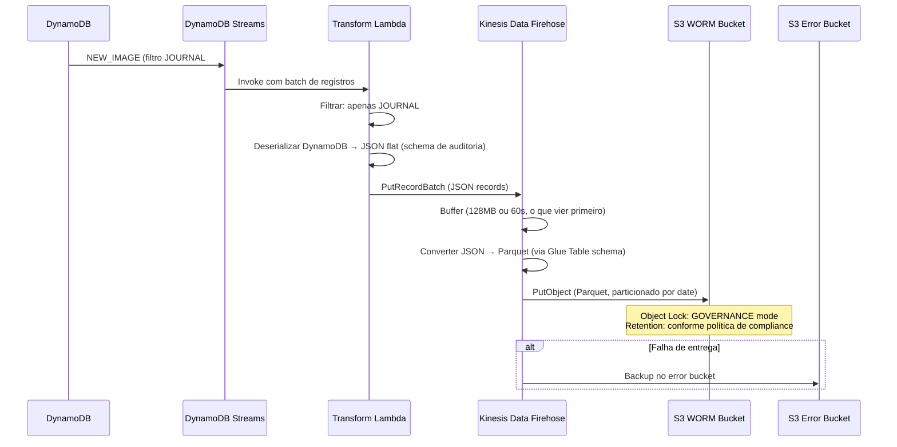
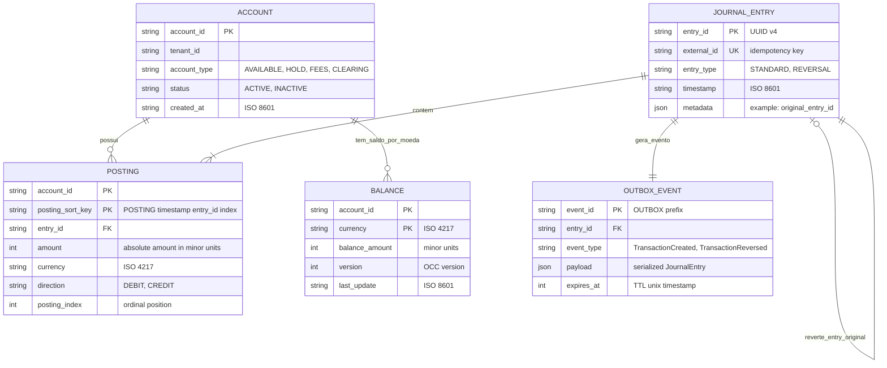
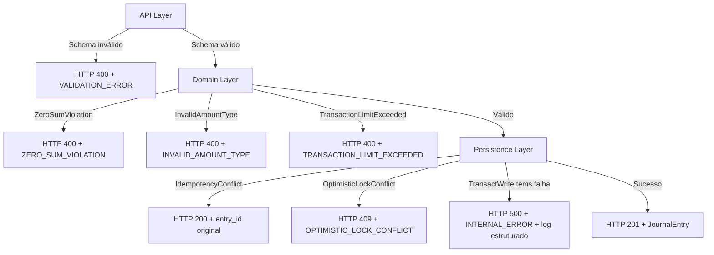

# Design — Double-Entry Ledger (Subledger)

## Visão Geral

Este documento descreve o design técnico do sistema de subledger baseado em partidas dobradas. O sistema é construído sobre AWS (DynamoDB, Lambda, S3, EventBridge) com Python 3.11+ seguindo DDD tático, padrões GoF adaptados para Python e infraestrutura como código via Terraform.

A arquitetura separa estritamente o **Write Path** (consistência forte via `TransactWriteItems`) do **Read Path** (projeções materializadas via CQRS com consistência eventual). O motor central (`LedgerEngine`) atua como fachada (GoF Facade) que orquestra validação, criação de lançamentos e persistência atômica.

### Decisões Arquiteturais Chave

| Decisão | Escolha | Justificativa |
|---------|---------|---------------|
| Persistência | DynamoDB single-table design | Escalabilidade horizontal, transações atômicas via `TransactWriteItems`, custo previsível |
| Representação monetária | Inteiros (minor units) | Elimina erros de arredondamento de ponto flutuante |
| Concorrência | OCC via campo `version` | Evita locks pessimistas, compatível com DynamoDB |
| Eventos | Transactional Outbox Pattern | Garante entrega confiável sem two-phase commit |
| Imutabilidade | Append-only + reversões | Trilha de auditoria completa, compliance financeiro |
| Leitura | CQRS com projeções materializadas | Desacopla leitura de escrita, permite otimização independente |
| IaC | Terraform com backend remoto S3 | Reproduzível, auditável, sem credenciais estáticas |

---

## Arquitetura

### Diagrama de Contexto (C4 — Nível 1)



### Diagrama de Fluxo — Write Path



### Diagrama de Fluxo — Event Pipeline



### Diagrama de Fluxo — Audit Pipeline (DynamoDB Streams → Firehose → S3 WORM)

O pipeline de auditoria opera de forma independente do Event Pipeline (Outbox). Enquanto o Outbox publica eventos de negócio para sistemas downstream via EventBridge, o Audit Pipeline captura os registros contábeis brutos (JournalEntries e Postings) via DynamoDB Streams, passa por uma Lambda de transformação leve que alimenta o Kinesis Data Firehose, e este se encarrega de batching, compressão, conversão para Parquet e entrega no S3 WORM.

A escolha do Firehose elimina a necessidade de gerenciar batching, particionamento e escrita no S3 manualmente — o serviço faz isso nativamente com retry, buffering configurável e entrega garantida.



#### Decisões de Design do Audit Pipeline

| Decisão | Escolha | Justificativa |
|---------|---------|---------------|
| Trigger | DynamoDB Streams (segundo consumer) | Desacopla auditoria do write path — zero impacto na latência de escrita |
| Filtro no Stream | Prefixos `JOURNAL#` e `ACCOUNT#` | Captura JournalEntries e Postings; Lambda filtra BALANCE# no código |
| Transform Lambda | Lambda leve entre Stream e Firehose | Filtra BALANCE#, achata DynamoDB JSON para schema flat, enriquece com campos de particionamento |
| Entrega | Kinesis Data Firehose | Batching, compressão, conversão Parquet e particionamento S3 nativos — sem gerenciar escrita manual |
| Formato | Parquet (via Firehose + Glue Table) | Colunar, comprimido, compatível com Athena/Redshift/Spark para analytics |
| Particionamento S3 | Dynamic Partitioning do Firehose: `audit/year=!{timestamp:yyyy}/month=!{timestamp:MM}/day=!{timestamp:dd}/tenant=!{partitionKeyFromQuery:tenant_id}/` | Queries eficientes por período e tenant no Athena, sem lógica custom |
| Object Lock | GOVERNANCE mode no bucket de destino | Impede deleção acidental; admins com permissão especial podem remover em caso de necessidade legal |
| Buffer | 128MB ou 60s (configurável) | Balanceia latência de entrega vs. tamanho de arquivo para eficiência de Athena |
| Error handling | S3 error bucket separado | Firehose entrega registros com falha de conversão em bucket dedicado para reprocessamento |
| DLQ da Transform Lambda | SQS dedicada (separada da DLQ do Publisher) | Falhas na transformação não devem bloquear o pipeline de eventos de negócio |

#### Componente: AuditTransformer (audit_exporter.py)

```python
"""
AuditTransformer — Lambda leve que consome DynamoDB Streams e alimenta
o Kinesis Data Firehose com registros contábeis normalizados.

Responsabilidades (apenas transformação, NÃO faz escrita no S3):
1. Recebe batch de registros do DynamoDB Stream (filtro JOURNAL# e ACCOUNT#)
2. Filtra: descarta itens com SK começando em BALANCE# (não relevantes para auditoria)
3. Deserializa DynamoDB JSON → schema flat de auditoria (AuditRecord)
4. Enriquece com campos de particionamento (year, month, day, tenant_id)
5. Envia para Firehose via PutRecordBatch

O Firehose cuida de:
- Batching (buffer de 128MB ou 60s)
- Conversão JSON → Parquet (via Glue Table schema)
- Particionamento dinâmico no S3 (year/month/day/tenant)
- Compressão (Snappy)
- Retry e entrega garantida
- Error handling (backup em error bucket)

Idempotência:
- DynamoDB Streams é at-least-once; registros duplicados podem chegar
- Firehose aceita duplicatas sem efeito colateral (append-only no S3)
- Para analytics, deduplicação é feita no query time (Athena/Spark) via entry_id + posting_index
"""
from dataclasses import dataclass

@dataclass(frozen=True)
class AuditRecord:
    """Schema flat para registros de auditoria no Firehose/Parquet."""
    record_type: str       # "JOURNAL_ENTRY" | "POSTING"
    entry_id: str          # UUID do JournalEntry
    external_id: str       # Chave de idempotência
    entry_type: str        # "STANDARD" | "REVERSAL"
    account_id: str | None # Presente apenas para POSTING
    amount: int | None     # Minor units, presente apenas para POSTING
    direction: str | None  # "DEBIT" | "CREDIT", presente apenas para POSTING
    currency: str | None   # ISO 4217, presente apenas para POSTING
    posting_index: int | None  # Índice ordinal, presente apenas para POSTING
    tenant_id: str         # Para particionamento dinâmico
    timestamp: str         # ISO 8601 do fato contábil
    metadata: str          # JSON serializado dos metadados do JournalEntry
    # Campos de particionamento (extraídos do timestamp)
    year: str
    month: str
    day: str


class AuditTransformer:
    """Transforma registros DynamoDB Stream em AuditRecords para Firehose."""

    def __init__(self, firehose_stream_name: str, firehose_client: "FirehoseClient") -> None: ...

    def process_stream_records(self, records: list[dict]) -> int:
        """
        1. Filtra registros relevantes (JOURNAL# e POSTING#, descarta BALANCE#)
        2. Converte para AuditRecord
        3. Envia batch para Firehose via PutRecordBatch
        4. Retorna número de registros enviados
        """
        ...

    def _filter_audit_records(self, records: list[dict]) -> list[dict]:
        """Mantém apenas JOURNAL# e itens com SK POSTING#."""
        ...

    def _to_audit_record(self, dynamo_record: dict) -> AuditRecord:
        """Deserializa DynamoDB JSON → AuditRecord flat."""
        ...
```

#### Diagrama de Particionamento S3 (via Firehose Dynamic Partitioning)

```
s3://ledger-audit-worm/
└── audit/
    └── year=2026/
        └── month=03/
            └── day=10/
                └── tenant=tenant_001/
                    ├── firehose-2026-03-10-14-30-00-abc123.parquet
                    └── firehose-2026-03-10-14-31-00-def456.parquet
```

> Nota: Os nomes dos arquivos são gerados pelo Firehose (prefixo configurável + timestamp + UUID). Diferente de PutObject manual, o Firehose gerencia o ciclo de vida dos arquivos automaticamente.

---

## Componentes e Interfaces

### Estrutura de Diretórios (DDD Tático)

```
ledger/
├── domain/                          # Núcleo do domínio — zero dependências externas
│   ├── __init__.py
│   ├── entities.py                  # Account (Entity)
│   ├── aggregates.py                # JournalEntry (Aggregate Root)
│   ├── value_objects.py             # Posting, Money, Currency, AccountType, Direction, EntryType
│   ├── events.py                    # TransactionCreated, TransactionReversed
│   ├── errors.py                    # DomainError, ZeroSumViolation, OptimisticLockConflict, etc.
│   ├── services.py                  # LedgerEngine (Domain Service / Facade)
│   ├── factories.py                 # JournalEntryFactory (Factory Method)
│   ├── validators.py                # ValidationChain (Chain of Responsibility)
│   └── ports.py                     # LedgerRepository (Port / Interface)
│
├── infrastructure/                  # Adaptadores e implementações concretas
│   ├── __init__.py
│   ├── dynamodb_repository.py       # DynamoDBLedgerRepository (Adapter)
│   ├── dynamodb_mapper.py           # Mapeamento domínio ↔ DynamoDB items
│   ├── publisher.py                 # Lambda Publisher (Observer) — Outbox → EventBridge
│   ├── audit_exporter.py            # AuditTransformer — Stream → Firehose (JSON flat)
│   └── audit_handler.py             # Lambda handler para Audit Pipeline (DynamoDB Streams → Firehose)
│
├── application/                     # Casos de uso e orquestração
│   ├── __init__.py
│   ├── commands.py                  # CreateJournalEntryCommand, CreateReversalCommand
│   ├── queries.py                   # GetBalanceQuery, GetStatementQuery
│   ├── handlers.py                  # CommandHandler, QueryHandler
│   └── dtos.py                      # Request/Response DTOs (ACL)
│
├── api/                             # Camada de API (Lambda handlers)
│   ├── __init__.py
│   ├── write_handler.py             # POST /entries, POST /reversals
│   ├── read_handler.py              # GET /balances, GET /statements
│   └── schema_validator.py          # JSON Schema validation (API layer)
│
├── tests/
│   ├── unit/                        # Testes unitários do domínio
│   ├── property/                    # Testes baseados em propriedades (Hypothesis)
│   └── integration/                 # Testes de integração com DynamoDB Local
│
└── infra/                           # Terraform
    ├── modules/
    │   ├── dynamodb/
    │   ├── lambda/
    │   ├── s3-audit/
    │   └── eventbridge/
    ├── environments/
    │   ├── dev/
    │   ├── staging/
    │   └── prod/
    └── versions.tf
```

### Interfaces Principais

#### Port: LedgerRepository (ports.py)

```python
"""
Porto (interface) do repositório do ledger.
Segue o padrão Ports & Adapters (Hexagonal Architecture).
O domínio depende apenas desta abstração — nunca de DynamoDB diretamente.
"""
from typing import Protocol

class LedgerRepository(Protocol):
    """
    Contrato do repositório do ledger.
    Implementações concretas (DynamoDB, in-memory para testes) devem
    satisfazer este protocolo.
    """

    def save_journal_entry(self, journal_entry: "JournalEntry") -> None:
        """
        Persiste atomicamente: JournalEntry + Postings + Balance updates + OutboxEvent.
        Levanta IdempotencyConflict se external_id já existe.
        Levanta OptimisticLockConflict se version do Balance diverge.
        """
        ...

    def find_journal_entry_by_id(self, entry_id: str) -> "JournalEntry | None":
        """Busca journal entry por entry_id (partition key)."""
        ...

    def find_journal_entry_by_external_id(self, external_id: str) -> "JournalEntry | None":
        """Busca journal entry pela chave de idempotência."""
        ...

    def get_balance(self, account_id: str, currency: str) -> "Balance | None":
        """Consulta saldo materializado — O(1) via GetItem."""
        ...

    def get_statement(
        self, account_id: str, cursor: str | None, page_size: int
    ) -> "StatementPage":
        """Consulta extrato paginado — Query com posting_sort_key."""
        ...
```

#### Domain Service: LedgerEngine (services.py) — GoF Facade

```python
"""
LedgerEngine — Fachada (GoF Facade) do domínio.

Orquestra o fluxo completo de criação de lançamentos contábeis:
1. Validação via ValidationChain (Chain of Responsibility)
2. Criação via JournalEntryFactory (Factory Method)
3. Persistência via LedgerRepository (Adapter)

Não contém lógica de persistência — delega ao repositório.
"""

class LedgerEngine:
    def __init__(
        self,
        repository: LedgerRepository,
        validation_chain: "ValidationChain",
        factory: "JournalEntryFactory",
    ) -> None: ...

    def create_journal_entry(
        self, command: "CreateJournalEntryCommand"
    ) -> "JournalEntry":
        """
        Fluxo principal de escrita:
        1. Verifica idempotência (external_id)
        2. Valida via chain of responsibility
        3. Cria aggregate via factory
        4. Persiste atomicamente via repository
        """
        ...

    def create_reversal(
        self, command: "CreateReversalCommand"
    ) -> "JournalEntry":
        """
        Cria lançamento de reversão:
        1. Busca journal entry original
        2. Gera postings inversos
        3. Persiste como novo journal entry tipo REVERSAL
        """
        ...
```

#### Validation Chain (validators.py) — GoF Chain of Responsibility

```python
"""
Cadeia de validação (GoF Chain of Responsibility).

Cada validador implementa o protocolo ValidationStrategy e é encadeado.
A cadeia é percorrida sequencialmente; o primeiro erro interrompe o fluxo.

Validadores disponíveis:
- ZeroSumValidator: soma dos postings == 0 por moeda
- MinorUnitsValidator: todos os valores são inteiros > 0
- TransactionLimitValidator: respeita limites do TransactWriteItems (100 itens, 4MB)
"""

class ValidationStrategy(Protocol):
    """GoF Strategy — cada validador implementa esta interface."""
    def validate(self, command: "CreateJournalEntryCommand") -> "ValidationResult": ...

class ValidationChain:
    """GoF Chain of Responsibility — encadeia validadores."""
    def __init__(self, validators: list[ValidationStrategy]) -> None: ...
    def validate(self, command: "CreateJournalEntryCommand") -> "ValidationResult": ...

class ZeroSumValidator:
    """Valida que sum(postings) == 0 por moeda."""
    def validate(self, command: "CreateJournalEntryCommand") -> "ValidationResult": ...

class MinorUnitsValidator:
    """Valida que todos os amounts são int > 0."""
    def validate(self, command: "CreateJournalEntryCommand") -> "ValidationResult": ...

class TransactionLimitValidator:
    """Valida limites do DynamoDB TransactWriteItems (100 itens, 4MB)."""
    def validate(self, command: "CreateJournalEntryCommand") -> "ValidationResult": ...
```

#### Factory: JournalEntryFactory (factories.py) — GoF Factory Method

```python
"""
JournalEntryFactory — GoF Factory Method.

Responsável por criar instâncias de JournalEntry com:
- Geração de entry_id (UUID v4)
- Timestamp de criação
- Validação de integridade do aggregate
- Geração do OutboxEvent associado

Subclasses ou métodos especializados para tipos diferentes:
- create_standard: lançamento padrão
- create_reversal: lançamento de reversão (postings inversos)
"""

class JournalEntryFactory:
    def create_standard(
        self, command: "CreateJournalEntryCommand"
    ) -> "JournalEntry": ...

    def create_reversal(
        self, original: "JournalEntry", command: "CreateReversalCommand"
    ) -> "JournalEntry": ...
```

---

## Modelos de Dados

### Entidades e Value Objects do Domínio

#### Modelo Entidade-Relacionamento (ER) do Subledger




#### Value Object: Money (value_objects.py)

```python
"""
Money — Value Object imutável para representação monetária.

Invariantes:
- amount é sempre int (minor units / centavos)
- amount > 0 (valores absolutos; direção é controlada por Direction)
- currency é código ISO 4217 (ex: "BRL", "USD")
"""
from dataclasses import dataclass

@dataclass(frozen=True)
class Money:
    amount: int       # minor units (centavos). Ex: R$ 10,50 = 1050
    currency: str     # ISO 4217. Ex: "BRL"

    def __post_init__(self) -> None:
        if not isinstance(self.amount, int):
            raise ValueError(f"amount deve ser int, recebido: {type(self.amount)}")
        if self.amount <= 0:
            raise ValueError(f"amount deve ser > 0, recebido: {self.amount}")
        if len(self.currency) != 3:
            raise ValueError(f"currency deve ter 3 caracteres ISO 4217: {self.currency}")
```

#### Value Object: Posting (value_objects.py)

```python
"""
Posting — Value Object imutável representando uma linha de débito ou crédito.

Convenção contábil:
- Débito (DEBIT): valor positivo na soma algébrica
- Crédito (CREDIT): valor negativo na soma algébrica

O signed_amount é calculado a partir de direction e money.amount.
"""
from enum import Enum

class Direction(str, Enum):
    DEBIT = "DEBIT"
    CREDIT = "CREDIT"

@dataclass(frozen=True)
class Posting:
    account_id: str
    money: Money
    direction: Direction
    index: int          # posição ordinal dentro do JournalEntry

    @property
    def signed_amount(self) -> int:
        """
        Retorna o valor com sinal para cálculo de zero-sum.
        Débito = +amount, Crédito = -amount.
        """
        return self.money.amount if self.direction == Direction.DEBIT else -self.money.amount
```

#### Value Objects Auxiliares

```python
class AccountType(str, Enum):
    """Tipos de conta suportados pelo subledger."""
    AVAILABLE = "AVAILABLE"   # Saldo líquido disponível
    HOLD = "HOLD"             # Saldo bloqueado
    FEES = "FEES"             # Conta de plataforma — taxas
    CLEARING = "CLEARING"     # Conta de plataforma — compensação

class EntryType(str, Enum):
    """Tipos de lançamento contábil."""
    STANDARD = "STANDARD"     # Lançamento padrão
    REVERSAL = "REVERSAL"     # Reversão de lançamento anterior
```

#### Entity: Account (entities.py)

```python
"""
Account — Entidade do domínio.

Cada conta pertence a um tenant e possui um tipo que determina
seu papel no subledger (Available, Hold, Fees, Clearing).
"""

@dataclass
class Account:
    account_id: str
    tenant_id: str
    account_type: AccountType
    status: str           # "ACTIVE" | "INACTIVE"
    created_at: str       # ISO 8601
```

#### Aggregate Root: JournalEntry (aggregates.py)

```python
"""
JournalEntry — Aggregate Root.

Protege o invariante principal do subledger: a soma algébrica de todos
os postings deve ser zero para cada moeda (partidas dobradas).

Regras do aggregate:
1. Mínimo 2 postings
2. Zero-sum por moeda
3. Imutável após criação (append-only)
4. Reversões criam novo JournalEntry referenciando o original

Eventos de domínio emitidos:
- TransactionCreated (para lançamentos padrão)
- TransactionReversed (para reversões)
"""

@dataclass(frozen=True)
class JournalEntry:
    entry_id: str              # UUID v4
    external_id: str           # Chave de idempotência
    entry_type: EntryType      # STANDARD | REVERSAL
    postings: tuple[Posting, ...]  # Imutável — tuple, não list
    metadata: dict              # Dados adicionais (ex: original_entry_id para reversões)
    timestamp: str             # ISO 8601
    outbox_event: "OutboxEvent"  # Evento transacional associado

    def validate_zero_sum(self) -> bool:
        """
        Verifica invariante de partidas dobradas.
        Agrupa postings por moeda e verifica que cada grupo soma zero.
        """
        sums_by_currency: dict[str, int] = {}
        for posting in self.postings:
            currency = posting.money.currency
            sums_by_currency[currency] = sums_by_currency.get(currency, 0) + posting.signed_amount
        return all(total == 0 for total in sums_by_currency.values())
```

#### Value Object: Balance

```python
"""
Balance — Projeção materializada do saldo de uma conta.

Protegida por OCC (Optimistic Concurrency Control) via campo version.
Atualizada atomicamente dentro da TransactWriteItems do Write Path.
"""

@dataclass
class Balance:
    account_id: str
    currency: str
    balance_amount: int    # minor units — pode ser negativo (ex: conta Hold)
    version: int           # OCC — incrementado a cada atualização
    last_update: str       # ISO 8601
```

#### Value Object: OutboxEvent

```python
"""
OutboxEvent — Evento transacional gravado atomicamente com o JournalEntry.

Segue o Transactional Outbox Pattern:
1. Gravado na mesma TransactWriteItems que o JournalEntry
2. Capturado via DynamoDB Streams (filtro OUTBOX#)
3. Publicado pelo Lambda Publisher no EventBridge

O event_id usa prefixo "OUTBOX#" para facilitar filtragem no Stream.
TTL (expires_at) garante limpeza automática após processamento.
"""

@dataclass(frozen=True)
class OutboxEvent:
    event_id: str          # "OUTBOX#{entry_id}"
    entry_id: str
    event_type: str        # "TransactionCreated" | "TransactionReversed"
    payload: dict          # Serialização do JournalEntry
    expires_at: int        # Unix timestamp para TTL do DynamoDB
```
### Modelo DynamoDB — Single-Table Design

| Entidade | PK | SK | Atributos Principais |
|----------|----|----|---------------------|
| ACCOUNT | `ACCOUNT#{account_id}` | `ACCOUNT#{account_id}` | tenant_id, type, status, created_at |
| BALANCE | `ACCOUNT#{account_id}` | `BALANCE#{currency}` | balance_amount, version, last_update |
| JOURNAL_ENTRY | `JOURNAL#{entry_id}` | `JOURNAL#{entry_id}` | external_id, entry_type, timestamp, metadata |
| POSTING | `ACCOUNT#{account_id}` | `POSTING#{timestamp}#{entry_id}#{index}` | entry_id, amount, direction, currency |
| OUTBOX_EVENT | `OUTBOX#{entry_id}` | `OUTBOX#{entry_id}` | event_type, payload, expires_at (TTL) |
| IDEMPOTENCY | `IDEMPOTENCY#{external_id}` | `IDEMPOTENCY#{external_id}` | entry_id, created_at |

#### GSI (Global Secondary Index)

| Nome | PK | SK | Projeção | Uso |
|------|----|----|----------|-----|
| GSI-EntryPostings | `JOURNAL#{entry_id}` | `POSTING#{index}` | ALL | Buscar todos os postings de um journal entry |

#### Composição da TransactWriteItems (Write Path)

Para um JournalEntry com N postings afetando M contas distintas:

```
Itens na transação:
  1x JournalEntry (Put)
  1x Idempotency record (Put com ConditionExpression attribute_not_exists)
  Nx Posting (Put)
  Mx Balance update (Update com ConditionExpression version = :expected_version)
  1x OutboxEvent (Put)
  ─────────────────
  Total: 3 + N + M itens (deve ser ≤ 100)
```

#### Diagrama ER Lógico

```mermaid
erDiagram
    ACCOUNT ||--o{ POSTING : "tem postings"
    ACCOUNT ||--|| BALANCE : "tem saldo por moeda"
    JOURNAL_ENTRY ||--|{ POSTING : "contém postings"
    JOURNAL_ENTRY ||--|| OUTBOX_EVENT : "gera evento"
    JOURNAL_ENTRY ||--o| JOURNAL_ENTRY : "reversal referencia original"

    ACCOUNT {
        string account_id PK
        string tenant_id
        string type
        string status
        string created_at
    }

    BALANCE {
        string account_id PK
        string currency SK
        int balance_amount
        int version
        string last_update
    }

    JOURNAL_ENTRY {
        string entry_id PK
        string external_id UK
        string entry_type
        string timestamp
        dict metadata
    }

    POSTING {
        string account_id PK
        string posting_sort_key SK
        string entry_id
        int amount
        string direction
        string currency
    }

    OUTBOX_EVENT {
        string event_id PK
        string entry_id
        string event_type
        dict payload
        int expires_at
    }
```

---

## Propriedades de Corretude (Correctness Properties)

*Uma propriedade é uma característica ou comportamento que deve ser verdadeiro em todas as execuções válidas de um sistema — essencialmente, uma declaração formal sobre o que o sistema deve fazer. Propriedades servem como ponte entre especificações legíveis por humanos e garantias de corretude verificáveis por máquina.*

### Property 1: Zero-sum round-trip

*Para qualquer* conjunto válido de postings agrupados por moeda, criar um JournalEntry e depois consultar seus postings deve produzir postings cuja soma algébrica é zero para cada moeda. Isto é: `sum(posting.signed_amount for posting in postings if posting.currency == c) == 0` para toda moeda `c`.

**Validates: Requirements 1.1, 1.5**

### Property 2: Mínimo dois postings

*Para qualquer* JournalEntry válido, o número de postings deve ser maior ou igual a 2. Entradas com menos de 2 postings devem ser rejeitadas.

**Validates: Requirements 1.4**

### Property 3: Rejeição de entradas desbalanceadas

*Para qualquer* conjunto de postings cuja soma algébrica não é zero para pelo menos uma moeda, o LedgerEngine deve rejeitar a criação do JournalEntry com erro `ZERO_SUM_VIOLATION`.

**Validates: Requirements 1.2**

### Property 4: Convenção de sinais (débito positivo, crédito negativo)

*Para qualquer* Posting, se `direction == DEBIT` então `signed_amount > 0`, e se `direction == CREDIT` então `signed_amount < 0`. O valor absoluto de `signed_amount` deve ser igual a `money.amount`.

**Validates: Requirements 1.3**

### Property 5: Validação de minor units

*Para qualquer* valor monetário submetido, se o valor não é um inteiro ou é menor ou igual a zero, o sistema deve rejeitar a requisição. Valores float, decimal, negativos ou zero devem resultar em erro estruturado (`INVALID_AMOUNT_TYPE` para tipo inválido, rejeição para valor ≤ 0).

**Validates: Requirements 2.1, 2.2, 2.3**

### Property 6: Atomicidade do Write Path

*Para qualquer* JournalEntry criado com sucesso, todos os itens associados (JournalEntry, Postings, Balance updates, OutboxEvent, registro de idempotência) devem existir no DynamoDB. Não deve haver estado parcial onde apenas alguns itens foram persistidos.

**Validates: Requirements 3.1, 3.3, 7.1**

### Property 7: Atomicidade em falha

*Para qualquer* operação de escrita que falhe (por qualquer motivo — OCC conflict, condition check, etc.), nenhum dos itens da transação deve ser persistido. O estado do banco deve permanecer inalterado.

**Validates: Requirements 3.2**

### Property 8: Idempotência por external_id

*Para qualquer* JournalEntry submetido N vezes com o mesmo `external_id`, todas as respostas após a primeira devem conter o mesmo `entry_id` da primeira submissão, e apenas um JournalEntry deve existir no banco.

**Validates: Requirements 4.2, 4.4**

### Property 9: Incremento de versão OCC

*Para qualquer* atualização bem-sucedida de Balance, o campo `version` deve ser incrementado em exatamente 1. Se `version_antes = V`, então `version_depois = V + 1`.

**Validates: Requirements 5.3**

### Property 10: Serialização de escritas concorrentes (OCC)

*Para qualquer* conjunto de N escritas concorrentes ao mesmo Balance, exatamente uma deve ser bem-sucedida e as demais devem receber erro `OPTIMISTIC_LOCK_CONFLICT`. O saldo final deve refletir apenas a escrita bem-sucedida.

**Validates: Requirements 5.4**

### Property 11: Modelagem de contas por usuário

*Para qualquer* usuário no sistema, devem existir no mínimo duas contas: uma do tipo `AVAILABLE` e uma do tipo `HOLD`.

**Validates: Requirements 6.1**

### Property 12: Round-trip de hold/release

*Para qualquer* operação de bloqueio seguida de liberação do mesmo valor na mesma conta, o saldo da conta Available deve retornar ao valor original e o saldo da conta Hold deve retornar a zero. O bloqueio debita Available e credita Hold; a liberação debita Hold e credita Available.

**Validates: Requirements 6.2, 6.3**

### Property 13: Prefixo OUTBOX# no event_id

*Para qualquer* OutboxEvent criado, o campo `event_id` deve começar com o prefixo `"OUTBOX#"` seguido do `entry_id` do JournalEntry associado.

**Validates: Requirements 7.5**

### Property 14: Ordenação cronológica e paginação de extratos

*Para qualquer* consulta de extrato paginada, os postings retornados devem estar em ordem cronológica (baseada no `posting_sort_key`), e a navegação por cursor deve produzir todos os postings sem duplicatas e sem omissões.

**Validates: Requirements 8.2, 8.5**

### Property 15: Imutabilidade de JournalEntries e Postings

*Para qualquer* JournalEntry ou Posting existente, tentativas de UPDATE ou DELETE devem ser rejeitadas pelo sistema. A única forma de correção é via criação de um novo JournalEntry do tipo REVERSAL.

**Validates: Requirements 9.1**

### Property 16: Anulação por reversão (reversal annulment)

*Para qualquer* JournalEntry original e seu Reversal correspondente, a soma combinada de todos os postings (original + reversal) deve ser zero para cada moeda. Adicionalmente, o Reversal deve ter `entry_type == REVERSAL`, postings com direções inversas ao original, e `metadata` contendo o `entry_id` do lançamento original.

**Validates: Requirements 9.2, 9.3, 9.4**

### Property 17: Formato do posting_sort_key

*Para qualquer* Posting persistido no DynamoDB, o sort key deve seguir o formato `"POSTING#{timestamp}#{entry_id}#{index}"`, onde timestamp é ISO 8601, entry_id é UUID e index é inteiro.

**Validates: Requirements 11.2**

### Property 18: Validação de limites do DynamoDB

*Para qualquer* JournalEntry que resulte em mais de 100 itens na TransactWriteItems ou payload maior que 4MB, o sistema deve rejeitar a operação antes de tentar a escrita, retornando erro estruturado (`TRANSACTION_LIMIT_EXCEEDED` ou `TRANSACTION_SIZE_EXCEEDED`).

**Validates: Requirements 14.1, 14.2**

### Property 19: Logging estruturado

*Para qualquer* operação de escrita (sucesso ou falha), o sistema deve emitir log estruturado (JSON) contendo no mínimo os campos `entry_id`, `operation` e `result`. Em caso de falha, o log deve incluir adicionalmente o tipo de erro.

**Validates: Requirements 15.1, 15.3**

### Property 20: Formato de resposta da API

*Para qualquer* resposta da API, respostas de sucesso devem seguir o formato `{"status": "success", "data": {...}, "metadata": {...}}` e respostas de erro devem seguir o formato `{"error": {"code": "<ERROR_CODE>", "message": "<descrição>"}}`.

**Validates: Requirements 16.1, 16.2**

---

## Tratamento de Erros

### Hierarquia de Erros do Domínio

```python
"""
Hierarquia de erros do domínio.

Todos os erros de domínio herdam de DomainError e carregam:
- code: código de erro estruturado (ex: ZERO_SUM_VIOLATION)
- message: descrição legível do erro
- http_status: código HTTP correspondente

A camada de API traduz DomainError → resposta HTTP estruturada.
"""

class DomainError(Exception):
    """Erro base do domínio."""
    def __init__(self, code: str, message: str, http_status: int = 400) -> None:
        self.code = code
        self.message = message
        self.http_status = http_status

class ZeroSumViolation(DomainError):
    """Soma dos postings não é zero para alguma moeda."""
    def __init__(self, currency: str, total: int) -> None:
        super().__init__(
            code="ZERO_SUM_VIOLATION",
            message=f"Postings não somam zero para moeda {currency}: total={total}",
            http_status=400,
        )

class InvalidAmountType(DomainError):
    """Valor monetário não é inteiro."""
    def __init__(self, received_type: str) -> None:
        super().__init__(
            code="INVALID_AMOUNT_TYPE",
            message=f"Valor monetário deve ser int, recebido: {received_type}",
            http_status=400,
        )

class OptimisticLockConflict(DomainError):
    """Conflito de versão no Balance (OCC)."""
    def __init__(self, account_id: str, expected_version: int) -> None:
        super().__init__(
            code="OPTIMISTIC_LOCK_CONFLICT",
            message=f"Conflito de versão para conta {account_id}, version esperada: {expected_version}",
            http_status=409,
        )

class IdempotencyConflict(DomainError):
    """external_id já existe — retorna entry_id original."""
    def __init__(self, external_id: str, existing_entry_id: str) -> None:
        self.existing_entry_id = existing_entry_id
        super().__init__(
            code="IDEMPOTENCY_CONFLICT",
            message=f"external_id {external_id} já existe com entry_id {existing_entry_id}",
            http_status=200,  # Idempotência retorna 200, não erro
        )

class TransactionLimitExceeded(DomainError):
    """Número de itens excede limite do TransactWriteItems (100)."""
    def __init__(self, item_count: int) -> None:
        super().__init__(
            code="TRANSACTION_LIMIT_EXCEEDED",
            message=f"TransactWriteItems excede 100 itens: {item_count}",
            http_status=400,
        )

class TransactionSizeExceeded(DomainError):
    """Payload excede limite do TransactWriteItems (4MB)."""
    def __init__(self, size_bytes: int) -> None:
        super().__init__(
            code="TRANSACTION_SIZE_EXCEEDED",
            message=f"TransactWriteItems excede 4MB: {size_bytes} bytes",
            http_status=400,
        )

class JournalEntryNotFound(DomainError):
    """Journal entry não encontrado."""
    def __init__(self, entry_id: str) -> None:
        super().__init__(
            code="JOURNAL_ENTRY_NOT_FOUND",
            message=f"Journal entry não encontrado: {entry_id}",
            http_status=404,
        )
```

### Fluxo de Tratamento de Erros por Camada



### Tabela de Códigos de Erro

| Código | HTTP | Camada | Descrição |
|--------|------|--------|-----------|
| `VALIDATION_ERROR` | 400 | API | Schema de entrada inválido |
| `ZERO_SUM_VIOLATION` | 400 | Domain | Postings não somam zero |
| `INVALID_AMOUNT_TYPE` | 400 | Domain | Valor não é inteiro |
| `TRANSACTION_LIMIT_EXCEEDED` | 400 | Domain | > 100 itens na transação |
| `TRANSACTION_SIZE_EXCEEDED` | 400 | Domain | > 4MB na transação |
| `OPTIMISTIC_LOCK_CONFLICT` | 409 | Persistence | Conflito de versão OCC |
| `JOURNAL_ENTRY_NOT_FOUND` | 404 | Domain | Entry não encontrado |
| `INTERNAL_ERROR` | 500 | Infrastructure | Erro inesperado do DynamoDB |

### Estratégia de Retry e Resiliência

- **OCC Conflict (409)**: O cliente deve fazer retry com backoff exponencial. O sistema não faz retry automático — a decisão é do consumidor.
- **TransactWriteItems failure**: Log estruturado com detalhes completos. Sem retry automático no Write Path (idempotência garante segurança de retry pelo cliente).
- **Lambda Publisher failure**: Registro encaminhado para DLQ. Alarme CloudWatch no tamanho da DLQ. Reprocessamento manual ou automático via DLQ redrive.
- **DynamoDB throttling**: Retry com backoff exponencial via SDK (configuração padrão do boto3).

---

## Estratégia de Testes

### Abordagem Dual: Testes Unitários + Testes Baseados em Propriedades

O sistema utiliza duas abordagens complementares de teste:

1. **Testes unitários**: Validam exemplos específicos, edge cases e condições de erro. Focam em cenários concretos e integração entre componentes.
2. **Testes baseados em propriedades (PBT)**: Validam propriedades universais que devem valer para todas as entradas válidas. Usam geração aleatória de dados para cobrir espaço de entrada amplo.

Ambas são necessárias: testes unitários capturam bugs concretos, testes de propriedade verificam corretude geral.

### Biblioteca de Property-Based Testing

- **Biblioteca**: [Hypothesis](https://hypothesis.readthedocs.io/) (Python)
- **Configuração**: Mínimo 100 iterações por teste de propriedade (`@settings(max_examples=100)`)
- **Tag**: Cada teste de propriedade deve conter comentário referenciando a propriedade do design:
  ```python
  # Feature: double-entry-ledger, Property 1: Zero-sum round-trip
  ```

### Generators (Hypothesis Strategies)

```python
"""
Generators para testes baseados em propriedades.

Cada generator produz instâncias válidas dos value objects do domínio,
respeitando invariantes e constraints.
"""
from hypothesis import strategies as st

# Moedas válidas
currencies = st.sampled_from(["BRL", "USD", "EUR", "GBP"])

# Money válido (minor units, int > 0)
money_strategy = st.builds(
    Money,
    amount=st.integers(min_value=1, max_value=10_000_000_00),  # até 100M em centavos
    currency=currencies,
)

# Posting válido
posting_strategy = st.builds(
    Posting,
    account_id=st.text(min_size=1, max_size=36, alphabet=st.characters(whitelist_categories=("L", "N"))),
    money=money_strategy,
    direction=st.sampled_from([Direction.DEBIT, Direction.CREDIT]),
    index=st.integers(min_value=0, max_value=99),
)

# Conjunto balanceado de postings (zero-sum por moeda)
def balanced_postings_strategy(min_pairs: int = 1, max_pairs: int = 10):
    """
    Gera conjuntos de postings que satisfazem zero-sum.
    Estratégia: para cada par, cria um DEBIT e um CREDIT com mesmo amount e currency.
    """
    ...

# JournalEntry válido
def journal_entry_strategy():
    """Gera JournalEntry com postings balanceados."""
    ...
```

### Mapeamento Propriedades → Testes

| Propriedade | Tipo de Teste | Nível | Descrição |
|-------------|---------------|-------|-----------|
| P1: Zero-sum round-trip | Property (Hypothesis) | Unit | Gerar postings balanceados, criar entry, verificar soma |
| P2: Mínimo dois postings | Property (Hypothesis) | Unit | Gerar entries, verificar len(postings) >= 2 |
| P3: Rejeição desbalanceada | Property (Hypothesis) | Unit | Gerar postings desbalanceados, verificar rejeição |
| P4: Convenção de sinais | Property (Hypothesis) | Unit | Gerar postings, verificar signed_amount vs direction |
| P5: Minor units validation | Property (Hypothesis) | Unit | Gerar valores inválidos (float, ≤0), verificar rejeição |
| P6: Atomicidade write path | Property (Hypothesis) | Integration | Criar entry, verificar todos os itens existem |
| P7: Atomicidade em falha | Unit + Integration | Integration | Forçar falha, verificar nenhum item persistido |
| P8: Idempotência | Property (Hypothesis) | Integration | Submeter mesmo external_id N vezes, verificar mesmo entry_id |
| P9: OCC version increment | Property (Hypothesis) | Integration | Atualizar balance, verificar version + 1 |
| P10: OCC serialização | Unit + Integration | Integration | Escritas concorrentes, verificar exatamente 1 sucesso |
| P11: Contas por usuário | Property (Hypothesis) | Unit | Criar usuário, verificar Available + Hold |
| P12: Hold/release round-trip | Property (Hypothesis) | Integration | Bloquear e liberar, verificar saldo restaurado |
| P13: Prefixo OUTBOX# | Property (Hypothesis) | Unit | Criar OutboxEvent, verificar prefixo |
| P14: Ordenação extrato | Property (Hypothesis) | Integration | Criar N postings, consultar, verificar ordem |
| P15: Imutabilidade | Unit | Unit | Tentar update/delete, verificar rejeição |
| P16: Reversal annulment | Property (Hypothesis) | Unit | Criar entry + reversal, verificar soma combinada = 0 |
| P17: Posting sort key format | Property (Hypothesis) | Unit | Gerar postings, verificar formato da sort key |
| P18: Limites DynamoDB | Property (Hypothesis) | Unit | Gerar entries grandes, verificar rejeição |
| P19: Logging estruturado | Property (Hypothesis) | Unit | Executar operações, verificar campos do log |
| P20: Formato resposta API | Property (Hypothesis) | Unit | Gerar respostas, verificar estrutura JSON |

### Testes de Integração com Finch + DynamoDB Local

```yaml
# finch-compose.yml
services:
  dynamodb-local:
    image: amazon/dynamodb-local:latest
    ports:
      - "8000:8000"
    command: ["-jar", "DynamoDBLocal.jar", "-sharedDb", "-inMemory"]
```

Os testes de integração:
1. Iniciam DynamoDB Local via Finch
2. Criam tabelas automaticamente (fixture pytest)
3. Validam propriedades P6–P10, P12, P14 contra DynamoDB real
4. Cada teste é isolado (tabela limpa entre testes)

### Testes Unitários — Foco

- Exemplos específicos de lançamentos contábeis (transferência, hold, release, fee)
- Edge cases: posting único (deve falhar), moedas mistas, valores extremos
- Condições de erro: cada código de erro tem pelo menos um teste unitário
- Integração entre componentes: ValidationChain → Factory → Engine

### Cobertura Esperada

- Domínio (value objects, aggregates, services): > 95% via unit + property tests
- Infrastructure (repository, mapper): > 80% via integration tests
- API (handlers, schema validation): > 80% via unit tests
- Lambda Publisher: > 70% via unit + integration tests

---
