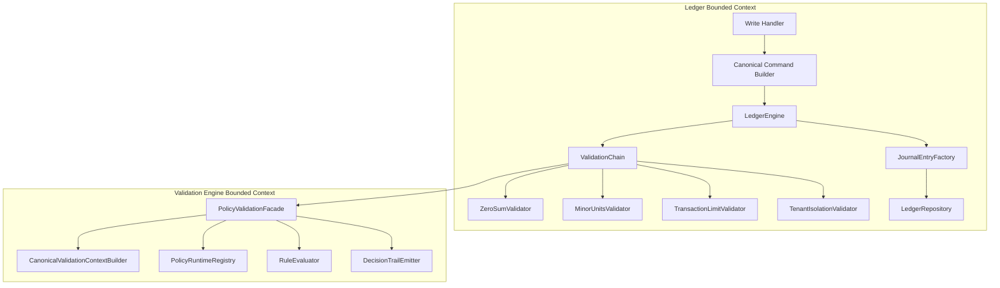
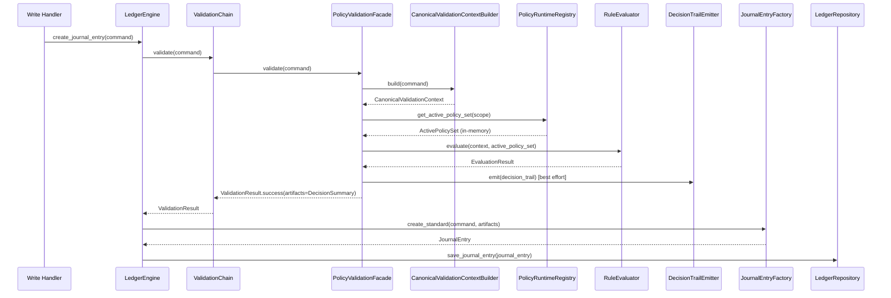
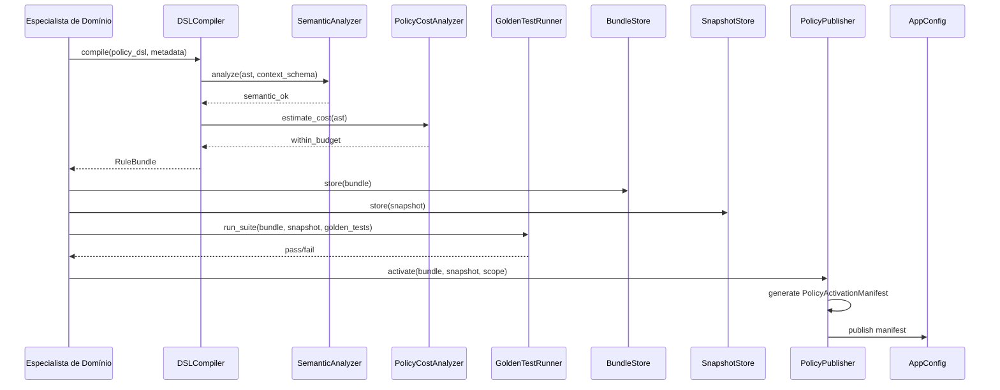
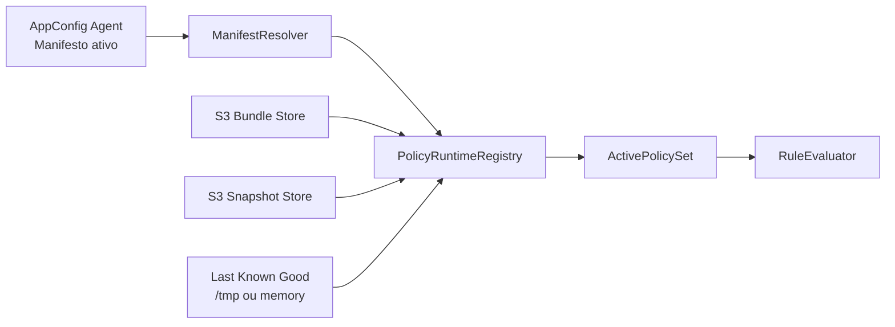

# Design — Motor de Validação Customizável (Validation Engine) — Versão Enriquecida

## Visão Geral

O Validation Engine é um bounded context separado (`src/validation_engine/`) responsável exclusivamente por **regras configuráveis de policy**. Ele **não substitui** as validações estruturais e invariantes do subledger — estas permanecem no bounded context do ledger, hardcoded e protegidas pelo modelo de domínio.

O motor permite que especialistas de domínio definam policies declarativas via DSL restrita. Essas policies são compiladas offline em artefatos imutáveis (`RuleBundle`), armazenadas em S3 com Object Lock (WORM), ativadas por manifesto versionado via AppConfig e avaliadas deterministicamente no write path do subledger.

A arquitetura é dividida em três camadas operacionais:

* **Structural Validation Layer**: invariantes do ledger; faz parte do bounded context do subledger.
* **Control Plane**: autoria, compilação, análise semântica, análise de custo, testes e ativação de policies.
* **Data Plane**: avaliação determinística de policies sobre um contexto canônico imutável, sem I/O durante a avaliação propriamente dita.

### Escopo

O Validation Engine trata apenas de regras como:

* limites por operação, tenant, produto, canal ou segmento;
* listas de bloqueio e allowlists;
* políticas de elegibilidade e restrições de produto;
* parâmetros de compliance previamente materializados em snapshots imutáveis.

### Fora de escopo

O Validation Engine não trata:

* invariantes contábeis do ledger;
* consultas live ao banco durante avaliação;
* motores antifraude probabilísticos;
* dependências de relógio do sistema, aleatoriedade ou chamadas externas;
* regras que exijam consistência transacional com fontes externas.

---

## Princípios e Decisões Arquiteturais

| Decisão                        | Escolha                                                                | Justificativa                                                                      |
| ------------------------------ | ---------------------------------------------------------------------- | ---------------------------------------------------------------------------------- |
| Separação estrutural vs policy | Invariantes do ledger fora da DSL                                      | Evita enfraquecimento do domínio e impede que regras essenciais virem configuração |
| Bounded context separado       | `src/validation_engine/`                                               | Mantém o ledger coeso e estável                                                    |
| Contexto canônico              | `CanonicalValidationContext` tipado e versionado                       | Garante determinismo, replay e compatibilidade                                     |
| Ativação atômica               | `PolicyActivationManifest` com `bundle + snapshot + evaluator_version` | Evita avaliar bundle novo com snapshot antigo                                      |
| Hot path estável               | `ActivePolicySet` em memória                                           | Remove resolução dinâmica por request no steady state                              |
| Avaliação pura                 | `RuleEvaluator.evaluate(context, active_policy_set)`                   | Zero I/O e zero efeitos colaterais na avaliação                                    |
| Composição de policies         | `DENY_OVERRIDES`                                                       | Semântica previsível e segura para domínio financeiro                              |
| Persistência mínima garantida  | `DecisionSummary` gravado atomicamente com o JournalEntry              | Torna a decisão auditável mesmo se o trail detalhado falhar                        |
| Auditoria expandida            | `DecisionTrail` assíncrono                                             | Mantém hot path enxuto; trail completo não é requisito de corretude                |
| Fail-closed                    | Falha sem `ActivePolicySet` válido rejeita a transação                 | Nunca aprova silenciosamente                                                       |
| Fallback controlado            | `Last Known Good` após inicialização bem-sucedida                      | Resiliência sem abrir mão de segurança                                             |
| Custo de execução limitado     | análise estática + orçamento de runtime                                | Mantém latência previsível no write path                                           |
| Escopo multi-tenant            | ativação por `PolicyScope`                                             | Permite regras distintas por tenant/operação/produto                               |

---

## Relação com o Ledger Existente

O subledger continua responsável por:

* `ZeroSumValidator`
* `MinorUnitsValidator`
* `TransactionLimitValidator`
* `TenantIsolationValidator`
* integridade de reversão, OCC, idempotência, atomicidade e append-only

O Validation Engine entra **depois** das validações estruturais e **antes** da criação final do aggregate persistido.



---

## Arquitetura

## Separação por Plano

| Aspecto                 | Structural Validation | Control Plane                         | Data Plane                                          |
| ----------------------- | --------------------- | ------------------------------------- | --------------------------------------------------- |
| Responsabilidade        | Invariantes do ledger | Autoria, compilação, testes, ativação | Avaliação de policy                                 |
| Local                   | `ledger/`             | `validation_engine/` offline          | `validation_engine/` dentro da Write Lambda         |
| Mutabilidade            | Código versionado     | Artefatos versionados                 | Somente `ActivePolicySet` em memória                |
| I/O                     | Não                   | S3, AppConfig, CI/CD                  | Somente na carga/refresh, nunca dentro do evaluator |
| Criticidade de latência | Alta                  | Baixa                                 | Alta                                                |
| Natureza das regras     | Estruturais           | Configuração e rollout                | Determinísticas                                     |

## Fluxo do Data Plane (Hot Path)

No steady state, o request path usa apenas objetos já carregados em memória.



## Fluxo do Control Plane



## Fluxo de Ativação e Refresh

A unidade de ativação não é mais apenas `artifact_hash`. É um manifesto completo.



---

## Modelo Operacional do Runtime

## `PolicyScope`

A política ativa é resolvida por escopo, não globalmente. Um escopo típico inclui:

* `tenant_id`
* `operation_type`
* `product_code`
* `channel`
* `environment`

Múltiplos tenants podem compartilhar o mesmo `policy_scope_id`.

```python
@dataclass(frozen=True)
class PolicyScope:
    tenant_id: str
    operation_type: str
    product_code: str | None = None
    channel: str | None = None
    environment: str = "prod"

    @property
    def scope_id(self) -> str:
        return f"{self.tenant_id}:{self.operation_type}:{self.product_code or '*'}:{self.channel or '*'}:{self.environment}"
```

## `PolicyActivationManifest`

A ativação é atômica. Bundle, snapshot e versão do evaluator andam juntos.

```python
@dataclass(frozen=True)
class PolicyActivationManifest:
    activation_id: str
    policy_scope_id: str
    artifact_hash: str
    snapshot_version: str
    context_schema_version: str
    evaluator_version: str
    activated_at: str
    activated_by: str
```

## `ActivePolicySet`

```python
@dataclass(frozen=True)
class ActivePolicySet:
    manifest: PolicyActivationManifest
    bundle: "RuleBundle"
    snapshot: "ReferenceSnapshot"
    loaded_at: str
    integrity_verified: bool
```

## Regras de inicialização

* Cold start sem `ActivePolicySet` válido: responder `503` e falhar fechado.
* Após a primeira inicialização bem-sucedida: falhas posteriores de refresh continuam usando o `Last Known Good`.
* Refresh troca o `ActivePolicySet` por swap atômico.
* Bundle e snapshot só entram em produção após verificação de integridade e compatibilidade.

---

## Componentes e Interfaces

## Estrutura de Diretórios

```text
src/validation_engine/
├── __init__.py
├── domain/
│   ├── __init__.py
│   ├── policy_ast.py               # AST/IR tipado da DSL
│   ├── models.py                   # RuleBundle, DecisionSummary, DecisionTrail, etc.
│   ├── context.py                  # CanonicalValidationContext, DerivedFacts
│   ├── errors.py                   # Erros do motor
│   ├── evaluator.py                # RuleEvaluator
│   ├── compiler.py                 # DSLCompiler, SemanticAnalyzer
│   └── cost_analyzer.py            # Limites de custo estático
├── application/
│   ├── __init__.py
│   ├── facade.py                   # PolicyValidationFacade
│   ├── runtime_registry.py         # PolicyRuntimeRegistry
│   ├── context_builder.py          # CanonicalValidationContextBuilder
│   └── publisher.py                # PolicyPublisher (control plane)
├── infrastructure/
│   ├── __init__.py
│   ├── manifest_resolver.py        # AppConfig Agent integration
│   ├── bundle_loader.py            # cache + S3 + integrity check
│   ├── snapshot_loader.py          # cache + S3 + schema check
│   ├── bundle_store.py             # S3 WORM
│   ├── snapshot_store.py           # S3 WORM
│   ├── decision_trail_emitter.py   # Firehose
│   └── lkg_store.py                # Last Known Good em /tmp
```

## Contrato com a `ValidationChain`

O contrato do ledger continua sendo `ValidationStrategy.validate(command) -> ValidationResult`, mas `ValidationResult` passa a carregar artefatos.

```python
@dataclass(frozen=True)
class ValidationArtifacts:
    decision_summary: "DecisionSummary | None" = None

    def merge(self, other: "ValidationArtifacts") -> "ValidationArtifacts":
        return ValidationArtifacts(
            decision_summary=other.decision_summary or self.decision_summary
        )

@dataclass(frozen=True)
class ValidationResult:
    is_valid: bool
    artifacts: ValidationArtifacts = ValidationArtifacts()

    @classmethod
    def success(cls, artifacts: ValidationArtifacts | None = None) -> "ValidationResult":
        return cls(is_valid=True, artifacts=artifacts or ValidationArtifacts())
```

Isso elimina a necessidade de mutar `command.metadata`.

## `PolicyValidationFacade`

```python
class PolicyValidationFacade:
    """
    Fachada do Data Plane.

    Responsável por:
    1. Construir o contexto canônico
    2. Resolver o escopo de policy
    3. Obter o ActivePolicySet
    4. Avaliar as rules
    5. Gerar DecisionSummary e DecisionTrail
    6. Retornar ValidationResult com artifacts explícitos

    Não muta o comando.
    """

    def __init__(
        self,
        context_builder: "CanonicalValidationContextBuilder",
        runtime_registry: "PolicyRuntimeRegistry",
        evaluator: "RuleEvaluator",
        trail_emitter: "DecisionTrailEmitter",
    ) -> None: ...

    def validate(self, command: "CreateJournalEntryCommand") -> ValidationResult: ...
```

## `PolicyRuntimeRegistry`

```python
class PolicyRuntimeRegistry(Protocol):
    """
    Registro local dos conjuntos ativos de policy.

    Responsável por:
    - resolver manifesto ativo por escopo
    - carregar bundle e snapshot quando necessário
    - validar integridade e compatibilidade
    - manter Last Known Good
    """

    def get_active_policy_set(self, scope: "PolicyScope") -> "ActivePolicySet":
        """
        Retorna o ActivePolicySet para o escopo.

        Em steady state: somente leitura local.
        Em miss/refresh: pode materializar fora do evaluator.
        """
        ...
```

## `CanonicalValidationContextBuilder`

```python
class CanonicalValidationContextBuilder(Protocol):
    """
    Constrói o contexto canônico visível à DSL.
    Toda a lógica de normalização fica aqui, não no evaluator.
    """

    def build(self, command: "CreateJournalEntryCommand") -> "CanonicalValidationContext":
        ...
```

## `RuleEvaluator`

```python
class RuleEvaluator:
    """
    Avaliador puro e determinístico.

    A função pura depende apenas de:
    - CanonicalValidationContext
    - ActivePolicySet

    Não faz I/O, não lê relógio, não usa estado global.
    """

    def evaluate(
        self,
        context: "CanonicalValidationContext",
        active_policy_set: "ActivePolicySet",
    ) -> "EvaluationResult":
        ...
```

## `DecisionTrailEmitter`

```python
class DecisionTrailEmitter(Protocol):
    """
    Emissão best-effort do trail completo.

    Falha de emissão não invalida a transação.
    A corretude mínima é garantida pelo DecisionSummary persistido atomicamente.
    """

    def emit(self, trail: "DecisionTrail") -> None: ...
```

---

## Contexto Canônico de Avaliação

A DSL não enxerga o comando bruto da API. Ela enxerga um contexto canônico, tipado, reduzido e replayable.

## `CanonicalValidationContext`

```python
@dataclass(frozen=True)
class CanonicalPosting:
    account_id: str
    amount: int
    currency: str
    direction: str
    account_type: str | None = None

@dataclass(frozen=True)
class CanonicalValidationContext:
    tenant_id: str
    external_id: str
    operation_type: str
    product_code: str | None
    channel: str | None
    postings: tuple[CanonicalPosting, ...]
    policy_context: Mapping[str, str | int | bool]
    facts: "DerivedFacts"
    context_schema_version: str
```

## `DerivedFacts`

`DerivedFacts` reduz complexidade da DSL e estabiliza replay.

```python
@dataclass(frozen=True)
class DerivedFacts:
    posting_count: int
    distinct_account_count: int
    currencies: tuple[str, ...]
    total_debits_by_currency: Mapping[str, int]
    total_credits_by_currency: Mapping[str, int]
    max_posting_amount: int
    has_platform_account: bool
```

### Regra importante

A DSL só pode acessar estes namespaces:

* `postings.*`
* `facts.*`
* `policy_context.*`
* `ref.*`

Ela não acessa metadata arbitrário, objetos Python arbitrários ou o comando cru.

---

## DSL e Semântica de Avaliação

## Modelo de composição

A DSL deixa de operar com “aprovações” e “rejeições” ambíguas por regra. Cada rule tem um `effect` e a composição do bundle é explícita.

### Semântica adotada

* `PolicyEffect = ALLOW | DENY`
* `CompositionMode = DENY_OVERRIDES`
* Se qualquer rule `DENY` casar, o resultado final é `REJECTED`
* Se nenhuma rule `DENY` casar, o resultado final é `APPROVED`
* Regras `ALLOW` podem existir para rastreabilidade, categorização ou futura extensibilidade, mas não sobrepõem deny

## Tipos principais

```python
class PolicyEffect(str, Enum):
    ALLOW = "ALLOW"
    DENY = "DENY"

class FinalVerdict(str, Enum):
    APPROVED = "APPROVED"
    REJECTED = "REJECTED"

class CompositionMode(str, Enum):
    DENY_OVERRIDES = "DENY_OVERRIDES"
```

## AST refinado

O AST deixa explícita a noção de coleção, filtro e projeção.

```python
@dataclass(frozen=True)
class CollectionRefNode:
    name: str  # "postings"

@dataclass(frozen=True)
class FieldAccessNode:
    path: tuple[str, ...]  # ex: ("facts", "posting_count")

@dataclass(frozen=True)
class RefAccessNode:
    path: tuple[str, ...]  # ex: ("daily_limit_minor",)

@dataclass(frozen=True)
class PredicateNode:
    binding: str
    condition: "ASTNode"

@dataclass(frozen=True)
class AggregateNode:
    function: str          # SUM, COUNT, MIN, MAX, ANY, ALL
    collection: CollectionRefNode
    where: "ASTNode | None" = None
    select: "ASTNode | None" = None

@dataclass(frozen=True)
class PolicyRuleNode:
    name: str
    priority: int
    condition: "ASTNode"
    effect: PolicyEffect
    message: str
```

## Exemplo de DSL

```text
POLICY deny_over_daily_limit PRIORITY 100
  WHEN SUM(postings WHERE direction == "DEBIT" SELECT amount) > ref.daily_limit_minor
  THEN DENY "Transaction exceeds daily debit limit"

POLICY deny_blocked_account PRIORITY 90
  WHEN ANY(postings WHERE account_id IN ref.blocked_accounts)
  THEN DENY "Blocked account"

POLICY allow_standard_brl PRIORITY 10
  WHEN facts.posting_count >= 2
    AND COUNT(postings WHERE currency == "BRL") == facts.posting_count
  THEN ALLOW "Standard BRL flow"
```

---

## Artefatos do Motor

## `RuleBundle`

O bundle compilado passa a carregar AST para audit/debug e um plano tipado para runtime.

```python
@dataclass(frozen=True)
class BundleCompatibility:
    dsl_version: str
    context_schema_version: str
    snapshot_schema_version: str
    evaluator_min_version: str

@dataclass(frozen=True)
class CompilationMetadata:
    author: str
    description: str
    compiled_at: str
    source_hash: str

@dataclass(frozen=True)
class RuleBundle:
    policy_set_id: str
    artifact_hash: str
    ast: "RuleAST"
    execution_plan: dict
    compatibility: BundleCompatibility
    composition_mode: CompositionMode
    metadata: CompilationMetadata

    def to_json(self) -> str: ...
    @classmethod
    def from_json(cls, data: str) -> "RuleBundle": ...
```

## `ReferenceSnapshot`

```python
@dataclass(frozen=True)
class ReferenceSnapshot:
    snapshot_version: str
    snapshot_schema_version: str
    created_at: str
    data: Mapping[str, int | str | bool | tuple[str, ...] | tuple[int, ...]]

    def lookup(self, path: tuple[str, ...]) -> object: ...
```

---

## Resultado da Avaliação

## `RuleMatchResult`

```python
@dataclass(frozen=True)
class RuleMatchResult:
    rule_name: str
    effect: PolicyEffect
    matched: bool
    priority: int
    message: str
```

## `EvaluationResult`

```python
@dataclass(frozen=True)
class EvaluationDecision:
    final_verdict: FinalVerdict
    matched_deny_rule: str | None
    rules: tuple[RuleMatchResult, ...]

@dataclass(frozen=True)
class EvaluationMetrics:
    evaluation_latency_ms: float
    evaluated_rules: int

@dataclass(frozen=True)
class EvaluationResult:
    decision: EvaluationDecision
    metrics: EvaluationMetrics
```

---

## Persistência e Auditoria

## `DecisionSummary`

`DecisionSummary` é o contrato persistido atomicamente junto com o `JournalEntry`. Isso faz parte da corretude do sistema.

```python
@dataclass(frozen=True)
class DecisionSummary:
    final_verdict: FinalVerdict
    policy_scope_id: str
    activation_id: str
    artifact_hash: str
    snapshot_version: str
    evaluator_version: str
    input_hash: str
    matched_deny_rule: str | None
    evaluation_latency_ms: float

    def to_metadata(self) -> dict:
        return {
            "policy_validation": {
                "final_verdict": self.final_verdict.value,
                "policy_scope_id": self.policy_scope_id,
                "activation_id": self.activation_id,
                "artifact_hash": self.artifact_hash,
                "snapshot_version": self.snapshot_version,
                "evaluator_version": self.evaluator_version,
                "input_hash": self.input_hash,
                "matched_deny_rule": self.matched_deny_rule,
                "evaluation_latency_ms": self.evaluation_latency_ms,
            }
        }
```

## `DecisionTrail`

`DecisionTrail` é auditoria expandida. Ele usa `external_id`, não `entry_id`, porque a validação ocorre antes da criação final do aggregate.

```python
@dataclass(frozen=True)
class DecisionTrail:
    external_id: str
    tenant_id: str
    policy_scope_id: str
    activation_id: str
    artifact_hash: str
    snapshot_version: str
    evaluator_version: str
    input_hash: str
    final_verdict: FinalVerdict
    matched_deny_rule: str | None
    rules: tuple[RuleMatchResult, ...]
    evaluation_latency_ms: float
    error_code: str | None
    timestamp: str

    def to_firehose_payload(self) -> dict: ...
```

### Regra de replay

Replay não reconstrói input a partir de `input_hash`. O `input_hash` é verificação de integridade. O replay ocorre a partir de:

* `JournalEntry` persistido;
* `policy_context` persistido no entry;
* `DecisionSummary`;
* `RuleBundle` identificado por `artifact_hash`;
* `ReferenceSnapshot` identificado por `snapshot_version`.

---

## Integração com o Ledger

## `CreateJournalEntryCommand`

O comando passa a separar metadados de policy dos metadados gerais.

```python
@dataclass(frozen=True)
class CreateJournalEntryCommand:
    external_id: str
    tenant_id: str
    postings: tuple["PostingInput", ...]
    policy_context: Mapping[str, str | int | bool] = field(default_factory=dict)
    metadata: Mapping[str, str] = field(default_factory=dict)
```

A DSL só enxerga `policy_context`, nunca `metadata` arbitrário.

## Ordem da `ValidationChain`

```python
validation_chain = ValidationChain(
    validators=[
        ZeroSumValidator(),
        MinorUnitsValidator(),
        TransactionLimitValidator(max_items=100, max_size_bytes=4_000_000),
        TenantIsolationValidator(),
        policy_validation_facade,
    ]
)
```

## Criação do aggregate

```python
validation_result = validation_chain.validate(command)

journal_entry = factory.create_standard(
    command=command,
    validation_artifacts=validation_result.artifacts,
)
```

A factory persiste o `DecisionSummary` no metadata do `JournalEntry` sem mutar o comando.

---

## Estratégia de Cache e Refresh

## Regras

* `PolicyRuntimeRegistry` mantém cache por `policy_scope_id`
* `ActivePolicySet` é imutável
* refresh faz swap atômico de instância
* `Last Known Good` é salvo localmente após cada carga válida
* bundle e snapshot são verificados por hash e compatibilidade antes de ativação local

## Fluxo de refresh

1. Resolver manifesto ativo do escopo via AppConfig Agent
2. Comparar `activation_id`
3. Se mudou, carregar bundle e snapshot
4. Validar `artifact_hash`, `snapshot_version`, `context_schema_version` e `evaluator_version`
5. Gravar `Last Known Good`
6. Trocar `ActivePolicySet`

## Política de degradação

* sem inicialização válida: `503`
* com inicialização válida prévia: usar `Last Known Good`
* se Firehose falhar: logar e seguir
* se bundle/snapshot falhar integridade: rejeitar e alarmar

---

## Análise de Custo e Limites

Para manter previsibilidade de latência, o compiler roda `PolicyCostAnalyzer`.

## Limites recomendados

| Limite                                  | Valor sugerido         |
| --------------------------------------- | ---------------------- |
| Regras por bundle                       | 64                     |
| Profundidade máxima do AST              | 12                     |
| Agregações por regra                    | 8                      |
| Tamanho do DSL fonte                    | 64 KB                  |
| Campos em `policy_context`              | 32                     |
| Tamanho de `policy_context` serializado | 16 KB                  |
| Scans totais por avaliação              | 32                     |
| Postings por comando visíveis à policy  | mesmo limite do ledger |

Bundles acima desses limites são rejeitados no Control Plane.

---

## Infraestrutura Terraform

## Módulos

### `infra/modules/validation-engine-s3/`

* bucket S3 com Object Lock e SSE-KMS
* versionamento obrigatório
* prefixos separados para `bundles/` e `snapshots/`

### `infra/modules/appconfig/`

O AppConfig passa a publicar o manifesto completo, não apenas `artifact_hash`.

Exemplo de payload lógico:

```json
{
  "version": "1",
  "scopes": {
    "tenantA:TRANSFER:PIX:*:prod": {
      "activation_id": "act_2026_03_11_001",
      "artifact_hash": "sha256:...",
      "snapshot_version": "snap_2026_03_11_001",
      "context_schema_version": "1.0",
      "evaluator_version": "1.2.0"
    }
  }
}
```

### `infra/modules/firehose-decision-trail/`

* Firehose dedicado para `DecisionTrail`
* Parquet + Snappy
* partição por `year/month/day/tenant/policy_scope_id`
* bucket de erros dedicado

### `infra/modules/cloudwatch-alarms/`

Alarmes mínimos:

* falta de `ActivePolicySet`
* falhas de refresh
* falhas de integridade
* aumento anômalo de `POLICY_REJECTED`
* falhas na emissão de `DecisionTrail`

## Estratégia de rollout

* `dev`: all-at-once
* `staging`: linear
* `prod`: canary/linear, nunca all-at-once

---

## Tratamento de Erros

## Hierarquia

```python
class ValidationEngineError(DomainError):
    pass

class PolicySyntaxError(ValidationEngineError): ...
class PolicySemanticError(ValidationEngineError): ...
class PolicyCostBudgetExceeded(ValidationEngineError): ...
class PolicyBundleUnavailable(ValidationEngineError): ...
class PolicySnapshotUnavailable(ValidationEngineError): ...
class PolicyBundleIntegrityFailure(ValidationEngineError): ...
class PolicyEngineNotReady(ValidationEngineError): ...
class PolicyEvaluationError(ValidationEngineError): ...
class PolicyRejected(ValidationEngineError): ...
class InvalidPolicyBundle(ValidationEngineError): ...
```

## Mapeamento sugerido

| Código                            | HTTP | Cenário                                      |
| --------------------------------- | ---- | -------------------------------------------- |
| `POLICY_SYNTAX_ERROR`             | 400  | Erro de sintaxe na DSL                       |
| `POLICY_SEMANTIC_ERROR`           | 400  | Tipagem, campo inválido, referência proibida |
| `POLICY_COST_BUDGET_EXCEEDED`     | 400  | Bundle acima do orçamento                    |
| `INVALID_POLICY_BUNDLE`           | 400  | Bundle inválido ou incompatível              |
| `POLICY_REJECTED`                 | 422  | Rejeição de policy de negócio                |
| `POLICY_ENGINE_NOT_READY`         | 503  | Sem policy válida carregada                  |
| `POLICY_BUNDLE_UNAVAILABLE`       | 503  | Bundle indisponível                          |
| `POLICY_SNAPSHOT_UNAVAILABLE`     | 503  | Snapshot indisponível                        |
| `POLICY_BUNDLE_INTEGRITY_FAILURE` | 500  | Hash divergente                              |
| `POLICY_EVALUATION_ERROR`         | 500  | Erro interno do evaluator                    |

Se o seu contrato atual da API exigir `400`, `POLICY_REJECTED` pode continuar em `400`; tecnicamente `422` é mais expressivo.

---

## Propriedades de Corretude

## Property 1: Structural rules não podem ser deslocadas para a DSL

Para qualquer transação inválida por invariante estrutural do ledger, a rejeição deve ocorrer antes do Validation Engine. Policies nunca substituem `ZeroSum`, `MinorUnits`, `TransactionLimit`, tenant isolation ou regras de reversão.

## Property 2: Ativação é atômica por manifesto

Para todo `PolicyActivationManifest`, `artifact_hash`, `snapshot_version`, `context_schema_version` e `evaluator_version` devem ser usados como unidade indivisível. Nunca pode haver avaliação com bundle novo e snapshot antigo.

## Property 3: Determinismo semântico do evaluator

Para todo `CanonicalValidationContext` e `ActivePolicySet`, duas avaliações devem produzir a mesma `EvaluationDecision`. Campos de métricas, como latência, não participam da igualdade semântica.

## Property 4: Composição `DENY_OVERRIDES`

Para qualquer conjunto de rules avaliadas, se ao menos uma rule `DENY` casar, o veredito final deve ser `REJECTED`, independentemente de rules `ALLOW` que também tenham casado.

## Property 5: Nenhuma mutação do comando

Para qualquer chamada a `PolicyValidationFacade.validate(command)`, o comando original deve permanecer inalterado. Todo resultado adicional deve ser retornado em `ValidationResult.artifacts`.

## Property 6: `DecisionSummary` é persistido atomicamente

Para toda transação aprovada, o `DecisionSummary` correspondente deve ser persistido junto com o `JournalEntry` na mesma `TransactWriteItems`. Não pode existir JournalEntry aprovado sem summary de policy, quando a policy validation está habilitada.

## Property 7: Falha no `DecisionTrailEmitter` não muda o veredito

Para qualquer avaliação aprovada ou rejeitada, falha na emissão do trail detalhado não pode alterar o resultado final da validação nem a persistência do `DecisionSummary`.

## Property 8: Replay usa contexto persistido, não apenas hash

Para toda decisão persistida, replay deve ser possível a partir do `JournalEntry` + `policy_context` persistido + `DecisionSummary` + `RuleBundle` + `ReferenceSnapshot`. `input_hash` serve apenas para integridade e correlação.

## Property 9: Escopo multi-tenant isolado

Para toda avaliação, o `PolicyScope` resolvido deve pertencer ao tenant e operação do comando. Nenhuma rule de outro tenant ou escopo pode ser aplicada.

## Property 10: Bundle e snapshot só entram em runtime se íntegros

Para todo bundle ou snapshot carregado do storage, integridade e compatibilidade devem ser validadas antes de produzir um novo `ActivePolicySet`.

## Property 11: `Last Known Good` só é usado após boot válido

Se o runtime nunca teve um `ActivePolicySet` válido, ele deve falhar com `503`. O `Last Known Good` só pode ser usado após uma carga bem-sucedida anterior.

## Property 12: `CanonicalValidationContext` é estável

Para todo comando semanticamente equivalente, a canonicalização deve produzir o mesmo `input_hash` e o mesmo contexto visível à policy.

## Property 13: Round-trip do bundle

Para todo `RuleBundle` válido, `to_json()` seguido de `from_json()` deve produzir bundle equivalente, com mesmo `artifact_hash`, `compatibility` e `execution_plan`.

## Property 14: Golden tests bloqueiam ativação

Nenhum manifesto de ativação pode ser publicado se a suíte obrigatória de golden tests falhar para aquele bundle/snapshot/escopo.

---

## Estratégia de Testes

## Tipos de teste

| Tipo                   | Foco                                                          |
| ---------------------- | ------------------------------------------------------------- |
| Unit tests             | AST, compiler, evaluator, runtime registry, errors            |
| Property-based tests   | determinismo, composição, canonicalização, round-trip, replay |
| Integration tests      | AppConfig Agent, S3 WORM, Firehose, cache refresh             |
| Contract tests         | integração com `ValidationChain` e `LedgerEngine`             |
| Chaos/resilience tests | falha de AppConfig, S3, Firehose, LKG                         |

## Estrutura sugerida

```text
tests/validation_engine/
├── unit/
│   ├── test_compiler.py
│   ├── test_cost_analyzer.py
│   ├── test_context_builder.py
│   ├── test_evaluator.py
│   ├── test_runtime_registry.py
│   ├── test_facade.py
│   └── test_errors.py
├── property/
│   ├── test_determinism.py
│   ├── test_deny_overrides.py
│   ├── test_canonicalization.py
│   ├── test_bundle_roundtrip.py
│   ├── test_activation_atomicity.py
│   ├── test_no_command_mutation.py
│   ├── test_summary_atomicity.py
│   └── test_replayability.py
└── integration/
    ├── test_appconfig_manifest.py
    ├── test_bundle_snapshot_loading.py
    ├── test_lkg_fallback.py
    ├── test_firehose_emission.py
    └── test_ledger_integration.py
```

## Tests indispensáveis

* cold start sem policy válida → `503`
* cold start com policy válida → sucesso
* refresh falho após inicialização → usa `LKG`
* troca de `activation_id` → carrega novo bundle e snapshot
* bundle incompatível com `context_schema_version` → rejeita carga
* rule `DENY` casando junto com `ALLOW` → rejeita
* `ValidationResult.artifacts` chega até a `JournalEntryFactory`
* falha no emitter → summary persistido, decisão preservada
* replay do contexto persistido produz o mesmo veredito

---

## Observações finais de desenho

Esta versão fortalece o sistema em cinco pontos que eram os mais sensíveis:

1. o ledger continua dono dos invariantes;
2. o motor de policy opera sobre contexto canônico, não sobre request cru;
3. o hot path consome `ActivePolicySet` em memória, não resolve bundle por request;
4. a decisão mínima auditável é persistida atomicamente;
5. replay passa a ser viável sem depender de “reconstruir input a partir de hash”.

Se você quiser, no próximo passo eu transformo esta versão em um documento ainda mais “copiável” para o seu repositório, já no formato de ADR/design doc com seções fixas e blocos Python completos.
